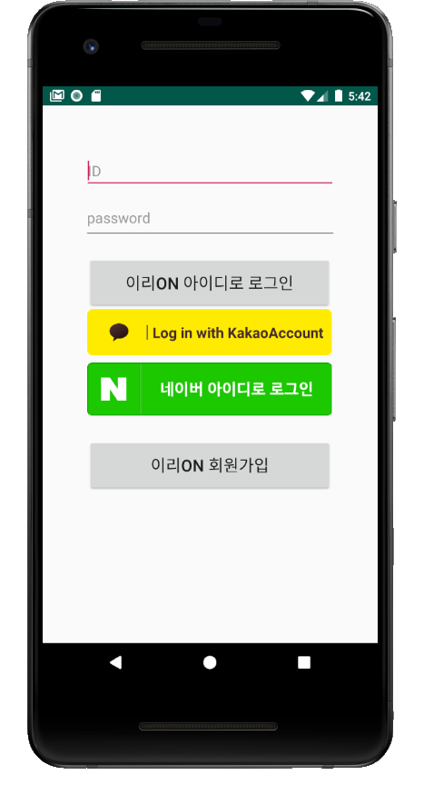
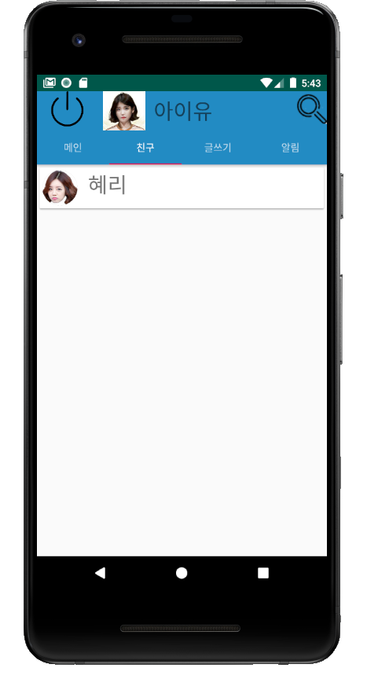
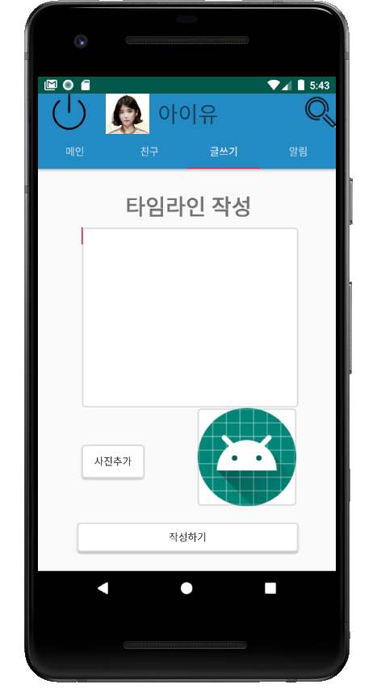
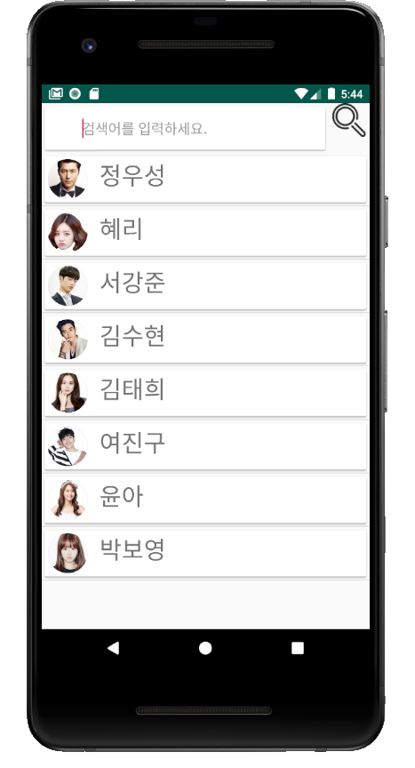
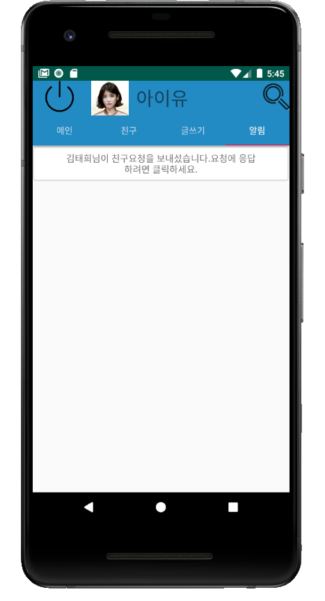
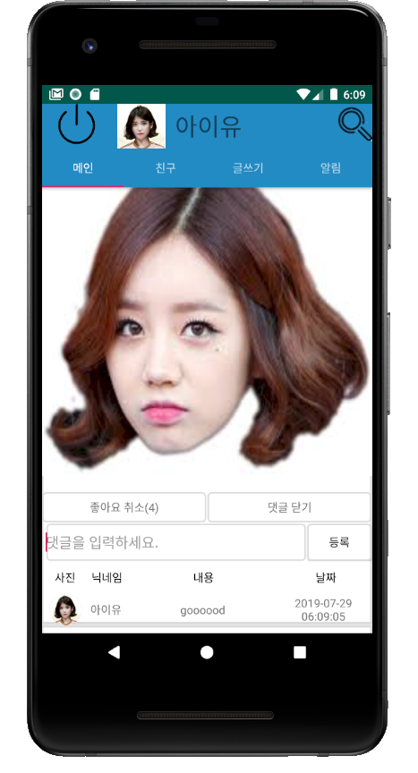

# timeline_app
타임라인 어플입니다.

## Tech Stack
JAVA, PHP, MYSQL

## Description
1. PHP 를 통한 Mysql과 JAVA 연동
2. Android Studio 사용
3. 웹 호스팅 서비스 (dothome)을 이용하여 자체 서버 구축

## ScreenShot

## MainFunction

1.회원가입,로그인
- php를 이용해서 android 와 mysql을 연동
- 카카오,네이버 api를 이용해 로그인,회원가입 구현(토큰을 이용)
- 로그인 시 자동 로그인 구현(로그아웃을 해야만 자동 로그인 취소 가능)

2.메인 타임라인
- 친구가 맺어진 사람과 자신의 타임라인만 보이게 구현
- recyclerview 를 통해 유연한 ui 구성
- PullRefreshLayout 으로 당기면 업데이트 기능 구현
- 유저의 초상화를 누를 경우 해당 유저의 개인 타임라인 이동

3.친구 리스트
- 친구가 수락된 유저의 리스트
- 친구 리스트를 클릭 할 경우 해당 친구의 개인 타임라인 이동

4.타임라인 작성
- 이미지 하나를 갤러리에서 불러와 올릴 수 있게 구현
- 게시물에는 작성자 이름,이미지,작성 시간,이미지,내용,좋아요,댓글이 담김

5.친구 추가 알림 기능
- 친구가 친구추가를 걸어왔을때 알림을 통해 수락 및 거절 가능

6.검색 기능
- 자신을 제외한 모든 유저들을 표시
- 검색창을 이용할 경우 검색어에 포함된 유저들을 표시
- 원하는 유저를 검색 후 클릭 시 해당 유저의 개인 타임라인 표시

7.개인 타임라인
- 해당 유저의 이름과 이미지 표시
- 자신과 해당 유저와의 관계 표시(친구신청하기,친구신청상태,친구,차단,요청들어옴 알림으로 가세요.)

8.좋아요,댓글
- 좋아요는 하나의 게시물에 한번만 누를 수 있게 구현
- 좋아요 옆의 숫자는 총 좋아요 개수를 표현
- 댓글 창에는 댓글을 작성한 유저의 이름과 이미지,내용 등이 포함

## Developer
- 김찬영(client,server)
